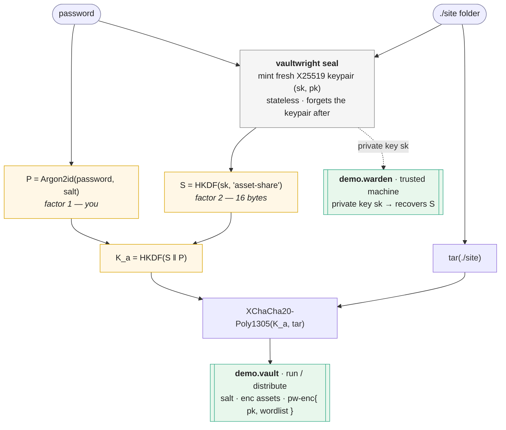

# vaultwright

[](https://github.com/alexey-lapin/vaultwright/actions/workflows/ci.yml)
[](LICENSE)

Serve a folder of static files from a **single binary** where the files are
**embedded and encrypted**, so the binary on disk reveals nothing about what's
inside. Unlocking requires **two factors**: a password *and* a fresh
challenge–response with a separate responder binary you keep on a trusted machine.

After unlock the files are served from memory on a random loopback port.

**Status:** released. Multi-target builds with on-demand, hash-verified stub download
work end-to-end.

## Install

**Homebrew (recommended)** — this repo doubles as its own tap. `brew` downloads without
the macOS quarantine attribute, so the CLI runs without a Gatekeeper prompt:

```sh
brew tap alexey-lapin/vaultwright https://github.com/alexey-lapin/vaultwright
brew install vaultwright
```

**Prebuilt binary** — from the [latest release](https://github.com/alexey-lapin/vaultwright/releases/latest);
these can seal for the host and download + verify other targets on demand. Pick the asset
for your os/arch and verify it against the release `checksums.txt`:

```sh
asset=vaultwright-darwin-arm64   # pick your os/arch
base=https://github.com/alexey-lapin/vaultwright/releases/latest/download
curl -L -O "$base/$asset"
curl -L -O "$base/checksums.txt"
grep " $asset\$" checksums.txt | shasum -a 256 -c -   # → "$asset: OK"
chmod +x "$asset" && mv "$asset" vaultwright
```

> On macOS, a binary downloaded via a **browser** (not `curl`) is quarantined; clear it
> with `xattr -d com.apple.quarantine vaultwright` before running. The same applies to the
> `*.vault` / `*.warden` binaries you hand to others if they save them from a browser,
> email, or AirDrop.

**From source** — builds the host stubs locally (seals host targets; multi-target needs a
release binary, whose embedded SHA-256 manifest authorizes downloads):

```sh
git clone https://github.com/alexey-lapin/vaultwright && cd vaultwright && make   # → bin/vaultwright
```

> `go install` is **not** supported: the working stubs and the trust-root manifest are
> assembled by CI into the release binaries and are not in the committed source, so a
> `go install` build can't seal.

See [SECURITY.md](SECURITY.md) for the threat model and how to report issues.

## Three binaries

| Binary | Holds | Role |
|--------|-------|------|
| `vaultwright` | nothing | Stateless builder. Each `vaultwright seal` mints a fresh keypair and emits the pair below, then forgets the keypair. |
| `*.vault` | public key + encrypted assets | The server you run/distribute. |
| `*.warden` | private key | The **second factor** — keep it on a trusted machine. |

## Build

```sh
make            # builds the host (GOOS/GOARCH) stubs, then bin/vaultwright
```

`vaultwright` embeds the host's vault/warden stubs plus the wordlist; the stubs are
compiled first because `vaultwright` bakes them in. A locally built CLI seals for the host
platform; other targets are downloaded on demand — only a release binary's embedded
SHA-256 manifest authorizes those downloads, so a `make` build refuses them.

**Stub files & git.** The stubs live at `internal/builtin/stubs/<role>/<os>_<arch>.stub`
and are committed as small text *placeholders* so `go build ./...` works on a fresh clone;
`make` overwrites the host ones with real (multi-MB) compiled binaries. To keep those
local rebuilds from showing up as changes, mark them skip-worktree after cloning:

```sh
git update-index --skip-worktree internal/builtin/stubs/*/*.stub
```

Never commit the built stubs. `make clean` restores the placeholders.

## Use

```sh
# 1. Seal a directory (prompts for a password, twice):
bin/vaultwright seal ./site -o demo
#   → demo.vault   (run / distribute)
#   → demo.warden  (keep on your trusted machine)

# 2. Run the server:
./demo.vault
#   Password: ********
#   Read this challenge to your warden:
#    1.define   2.word     3.tape    ...        (24 words)

# 3. On your trusted machine, answer it:
./demo.warden
#   Enter the challenge from vault (24 words): define word tape ...
#   Type this response back into vault:
#    1.cash     2.primary  3.young   ...        (12 words)

# 4. Back in the vault, type the 12 words. It then prints:
#   Unlocked. Serving 3 files in memory.
#     →  http://127.0.0.1:53847/c8f3a91b/
```

Open the printed URL in a private browser window. Prefixes are accepted when
typing words (e.g. `aban` → `abandon`); a mistyped word is caught by the checksum.

### `vault` flags

| Flag | Default | Meaning |
|------|---------|---------|
| `--idle` | `15m` | Auto-shutdown after this much inactivity (`0` = never). |
| `--port` | random | Fixed TCP port. |
| `--addr` | `127.0.0.1` | Bind address (loopback only by default). |
| `--no-path-key` | off | Drop the unguessable URL path-key segment. |
| `--entry-point` | `index.html` | Directory document served at the root. |
| `--fallback` | off | Serve the entry-point for unmatched non-file routes (SPA refresh/deep links). |

### `vaultwright seal` flags

| Flag | Meaning |
|------|---------|
| `-o <name>` | Output base name (default: the assets dir name). |
| `--warden-pass` | Also protect the warden binary with a passphrase (prompted). |
| `--vault-target os/arch` | Vault target platform (repeatable; default: host). |
| `--warden-target os/arch` | Warden target platform (repeatable; default: host). |
| `--stub-dir <dir>` | Resolve stubs from this directory first (offline mirror). |
| `--offline` | Never download stubs (embedded / cache / `--stub-dir` only). |

Targets are independent and may be repeated, e.g. build a Windows + Linux vault with a
macOS warden — all from one keypair:

```sh
vaultwright seal ./site -o demo \
  --vault-target windows/amd64 --vault-target linux/arm64 \
  --warden-target darwin/arm64
# → demo.vault-windows-amd64.exe  demo.vault-linux-arm64  demo.warden-darwin-arm64
```

With explicit targets the outputs are suffixed (and `.exe` is added for Windows);
the plain host default writes `demo.vault` / `demo.warden`. Non-host stubs are
downloaded from the release and verified against the embedded SHA-256 manifest;
pre-fetch them with `vaultwright fetch-stubs --all` (or `fetch-stubs os/arch …`).

## How it works

**Seal** mints a fresh keypair per build and splits trust into two factors — one you
know (the password), one the warden holds (the private key) — before either binary exists:



**Unlock** runs a fresh ephemeral handshake every time, so a captured response can't be
replayed. Either factor alone dead-ends — a wrong password at the metadata step, a wrong
response at asset decryption:

```mermaid
sequenceDiagram
    autonumber
    actor You
    participant V as demo.vault — server
    participant W as demo.warden — 2nd factor

    You->>V: password
    Note over V: P = Argon2id(pw, salt)<br/>open pw-enc → pk, wordlist<br/>✗ wrong password stops here
    Note over V: make ephemeral keypair e
    V-->>You: 24-word challenge (e.pub)
    You->>W: read the 24 words aloud
    Note over W: shared = X25519(sk, e.pub)<br/>resp = S ⊕ HKDF(shared)
    W-->>You: 12-word response
    You->>V: type the 12 words
    Note over V: recover S → K_a = HKDF(S ‖ P)<br/>decrypt assets in memory<br/>✗ wrong response stops here
    V-->>You: http://127.0.0.1:PORT/&lt;key&gt;/ (served from RAM)
```

For reference, the key hierarchy in one block:

```
P    = Argon2id(password, salt)              factor 1 (you)
sk,pk                                        fresh X25519 keypair per seal
S    = HKDF(sk, "…asset-share…")             16 bytes; factor 2 lives in warden
K_a  = HKDF(S || P)                          asset key
assets = XChaCha20-Poly1305(K_a, files)
```

On disk the vault contains only a plaintext random salt followed by opaque
ciphertext (assets, and a password-encrypted blob holding the public key and the
wordlist). No magic headers, no plaintext wordlist.

## Security model & limits

- **Threat model:** full binary access — the attacker can run, disassemble, and
  patch `vault`. Nothing in `vault` alone can decrypt.
- **Two factors, both required:** a leaked password is useless without the warden;
  a stolen `vault` is useless without both.
- **Replay-proof:** the handshake is fresh each unlock, so a captured response is
  useless next time. (This is why the codes are word phrases, not short PINs — a
  non-replayable asymmetric exchange can't fit in a handful of characters.)
- **`warden` is the factor:** whoever has the `warden` binary + the password can
  unlock. Protect it like a hardware key; optionally add `--warden-pass`.
- **In scope:** hiding asset *content and type*. **Out of scope:** hiding that
  encrypted data exists at all (entropy analysis still sees a high-entropy blob);
  a compromised trusted machine.

## Tests

```sh
go test ./...
go test ./internal/wordcodec -run=x -fuzz=FuzzRoundTrip -fuzztime=10s
```
